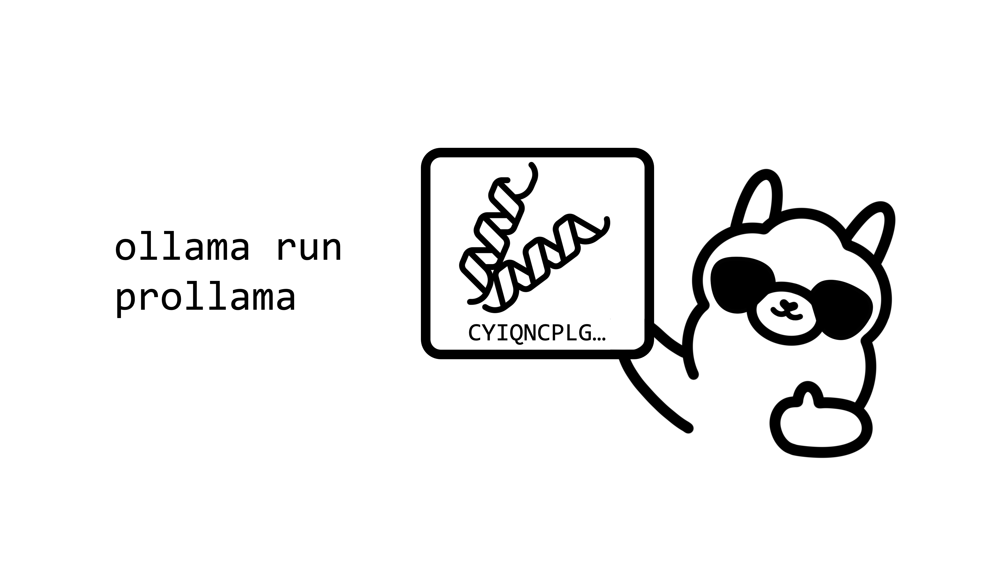

# ProLLaMA-on-Ollama

<h3 align="right">Colby T. Ford, Ph.D.</h3>

This repository shows how to convert and serve the ProLLaMA model in Ollama.


<a href="https://blog.colbyford.com/42c267e32ba5"></a>




## 1. Convert the HuggingFace model to GGUF format

Run the steps in the [convert_to_gguf.ipynb](convert_to_gguf.ipynb) notebook.

## 2. Make Model in Ollama

```bash
ollama create prollama -f ./Modelfile
```

## 3. Run the Model in the Ollama CLI
```bash
ollama run prollama
```
